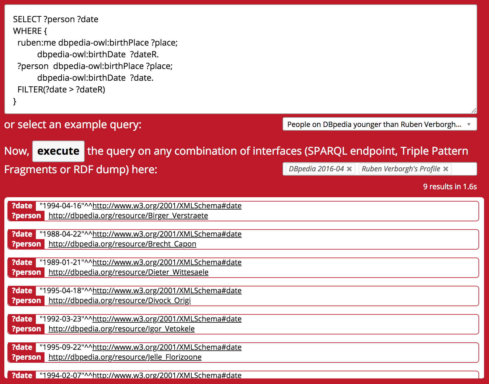

## Demonstration overview
{:#demo}

In this demonstration, we offer the possibility for executing SPARQL queries
over a federation of heterogeneous interfaces.
This demonstration can be used directly within the browser,
and is available on the [Comunica website](http://comunica.linkeddatafragments.org/){:.mandatory}.

This demonstration is an adaption of the [Triple Pattern Fragments Web client](cite:cites tpfdemo),
with the main difference that instead of using the Triple Pattern Fragments engine for querying,
it uses the Comunica engine.
The implementation of this Web client is available on [GitHub](https://github.com/comunica/jQuery-Widget.js){:.mandatory},
under the open MIT license so that it can be reused for different use cases.

We provide a collection of example queries with a predefined set of sources,
where some queries federate over different heterogeneous sources.
 shows an example query that federates
over a Triple Pattern Fragments interface and a Linked Data document.
Additionally, users can also write custom queries,
and add more datasources by their URL.

<figure id="screenshot">

<figcaption markdown="block">
Example SPARQL query in the Comunica Web client that federates over the
DBpedia Triple Pattern Fragments interface and a FOAF profile.
</figcaption>
</figure>

At the time of writing, SPARQL endpoints, Triple Pattern Fragments interfaces and raw RDF files can be queried.
Internally, Comunica will identify the source type through a set of heuristics.
SPARQL endpoints are tested using a simple `ASK` query through the [SPARQL protocol](cite:cites spec:sparqlprot).
Triple Pattern Fragments interfaces are tested by checking if the required set of hypermedia controls is available.
Finally, RDF files are tested with the lowest priority by checking their content type.
